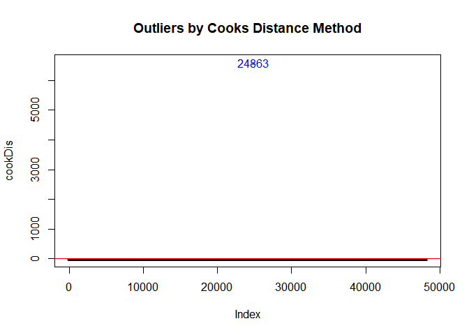
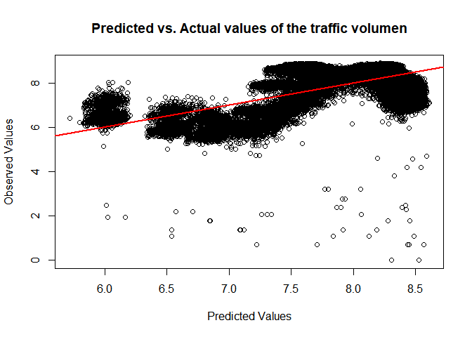

Metro Interstate Traffic Volumen
================
Simon Gamboa
2022-07-04

# GOAL

We will be analyzing how changes in the climate can affect the traffic
volume for westbound interstate I-94 from 2012-2018. Then we carry out a
multilinear regression model to predict how temperature, raining and
snow could impact the traffic volume.

# Data set information

We selected the metro interstate traffic volume data set from the UCI
Machine Learning Repository (2022). The data was captured from hourly
Interstate 94 Westbound traffic volume for MN DoT ATR station 301,
roughly midway between Minneapolis and St Paul, MN. Hourly weather
features and holidays included for impacts on traffic volume.The data
set belong to Traffic data from Minnesota Department of Transportation -
USA.

\#LOAD LIBRARIES

    ## Warning: package 'jtools' was built under R version 4.2.2

\#STEP 1: READ AND PROCESS THE DATA \##1.1 Read the data

``` r
df <- read.csv("Metro_Interstate_Traffic_Volume.csv", header=TRUE, sep=",")
head(df, 3)
```

    ##   holiday   temp rain_1h snow_1h clouds_all weather_main weather_description
    ## 1    None 288.28       0       0         40       Clouds    scattered clouds
    ## 2    None 289.36       0       0         75       Clouds       broken clouds
    ## 3    None 289.58       0       0         90       Clouds     overcast clouds
    ##             date_time traffic_volume
    ## 1 2012-10-02 09:00:00           5545
    ## 2 2012-10-02 10:00:00           4516
    ## 3 2012-10-02 11:00:00           4767

\##1.2 Process the data \###1.2.1 check unique value

``` r
unique(df$holiday)
```

    ##  [1] "None"                      "Columbus Day"             
    ##  [3] "Veterans Day"              "Thanksgiving Day"         
    ##  [5] "Christmas Day"             "New Years Day"            
    ##  [7] "Washingtons Birthday"      "Memorial Day"             
    ##  [9] "Independence Day"          "State Fair"               
    ## [11] "Labor Day"                 "Martin Luther King Jr Day"

``` r
unique(df$weather_main)
```

    ##  [1] "Clouds"       "Clear"        "Rain"         "Drizzle"      "Mist"        
    ##  [6] "Haze"         "Fog"          "Thunderstorm" "Snow"         "Squall"      
    ## [11] "Smoke"

\###1.2.2 check null and blank value, drop row that contain null or
blank value

``` r
sum(is.na(df))
```

    ## [1] 0

``` r
sum(df=="")
```

    ## [1] 0

\###1.2.3 split date and time column variable

``` r
df$time <- as.integer(format(as.POSIXct(df$date_time), format = "%H"))
head(df)
```

    ##   holiday   temp rain_1h snow_1h clouds_all weather_main weather_description
    ## 1    None 288.28       0       0         40       Clouds    scattered clouds
    ## 2    None 289.36       0       0         75       Clouds       broken clouds
    ## 3    None 289.58       0       0         90       Clouds     overcast clouds
    ## 4    None 290.13       0       0         90       Clouds     overcast clouds
    ## 5    None 291.14       0       0         75       Clouds       broken clouds
    ## 6    None 291.72       0       0          1        Clear        sky is clear
    ##             date_time traffic_volume time
    ## 1 2012-10-02 09:00:00           5545    9
    ## 2 2012-10-02 10:00:00           4516   10
    ## 3 2012-10-02 11:00:00           4767   11
    ## 4 2012-10-02 12:00:00           5026   12
    ## 5 2012-10-02 13:00:00           4918   13
    ## 6 2012-10-02 14:00:00           5181   14

\###1.2.3 drop unneeded columns and rows

``` r
df <- df[,-c(7,8)]
head(df)
```

    ##   holiday   temp rain_1h snow_1h clouds_all weather_main traffic_volume time
    ## 1    None 288.28       0       0         40       Clouds           5545    9
    ## 2    None 289.36       0       0         75       Clouds           4516   10
    ## 3    None 289.58       0       0         90       Clouds           4767   11
    ## 4    None 290.13       0       0         90       Clouds           5026   12
    ## 5    None 291.14       0       0         75       Clouds           4918   13
    ## 6    None 291.72       0       0          1        Clear           5181   14

``` r
#There were deleted temperature values as 0 because is outside kelvin range
library(dplyr)
df <- df %>% filter(temp >= 243)
```

\#STEP 2: TRANSFORMING DATA SET \##2.1 check categories variable
frequency \##load & required package

``` r
#install.packages("dplyr")
library(dplyr)
#install.packages("funModeling")
library(funModeling)
```

## 2.2 First approaching of exploation data analytics (EDA)

``` r
basic_eda <- function(df)
{
  glimpse(df)
  print(status(df))
  freq(df, path_out = ".") 
  print(profiling_num(df))
  plot_num(df)
  describe(df)
}
basic_eda(df) 
```

    ## Rows: 48,194
    ## Columns: 8
    ## $ holiday        <chr> "None", "None", "None", "None", "None", "None", "None",…
    ## $ temp           <dbl> 288.28, 289.36, 289.58, 290.13, 291.14, 291.72, 293.17,…
    ## $ rain_1h        <dbl> 0, 0, 0, 0, 0, 0, 0, 0, 0, 0, 0, 0, 0, 0, 0, 0, 0, 0, 0…
    ## $ snow_1h        <dbl> 0, 0, 0, 0, 0, 0, 0, 0, 0, 0, 0, 0, 0, 0, 0, 0, 0, 0, 0…
    ## $ clouds_all     <int> 40, 75, 90, 90, 75, 1, 1, 1, 20, 20, 20, 1, 1, 1, 1, 1,…
    ## $ weather_main   <chr> "Clouds", "Clouds", "Clouds", "Clouds", "Clouds", "Clea…
    ## $ traffic_volume <int> 5545, 4516, 4767, 5026, 4918, 5181, 5584, 6015, 5791, 4…
    ## $ time           <int> 9, 10, 11, 12, 13, 14, 15, 16, 17, 18, 19, 20, 21, 22, …
    ##                      variable q_zeros      p_zeros q_na p_na q_inf p_inf
    ## holiday               holiday       0 0.000000e+00    0    0     0     0
    ## temp                     temp       0 0.000000e+00    0    0     0     0
    ## rain_1h               rain_1h   44727 9.280616e-01    0    0     0     0
    ## snow_1h               snow_1h   48131 9.986928e-01    0    0     0     0
    ## clouds_all         clouds_all    1978 4.104245e-02    0    0     0     0
    ## weather_main     weather_main       0 0.000000e+00    0    0     0     0
    ## traffic_volume traffic_volume       2 4.149894e-05    0    0     0     0
    ## time                     time    2037 4.226667e-02    0    0     0     0
    ##                     type unique
    ## holiday        character     12
    ## temp             numeric   5842
    ## rain_1h          numeric    372
    ## snow_1h          numeric     12
    ## clouds_all       integer     60
    ## weather_main   character     11
    ## traffic_volume   integer   6704
    ## time             integer     24

    ## Warning: `guides(<scale> = FALSE)` is deprecated. Please use `guides(<scale> =
    ## "none")` instead.

    ##                      holiday frequency percentage cumulative_perc
    ## 1                       None     48133      99.87           99.87
    ## 2                  Labor Day         7       0.01           99.88
    ## 3              Christmas Day         6       0.01           99.89
    ## 4  Martin Luther King Jr Day         6       0.01           99.90
    ## 5              New Years Day         6       0.01           99.91
    ## 6           Thanksgiving Day         6       0.01           99.92
    ## 7               Columbus Day         5       0.01           99.93
    ## 8           Independence Day         5       0.01           99.94
    ## 9               Memorial Day         5       0.01           99.95
    ## 10                State Fair         5       0.01           99.96
    ## 11              Veterans Day         5       0.01           99.97
    ## 12      Washingtons Birthday         5       0.01          100.00

    ## Warning: `guides(<scale> = FALSE)` is deprecated. Please use `guides(<scale> =
    ## "none")` instead.

    ##    weather_main frequency percentage cumulative_perc
    ## 1        Clouds     15164      31.46           31.46
    ## 2         Clear     13381      27.76           59.22
    ## 3          Mist      5950      12.35           71.57
    ## 4          Rain      5672      11.77           83.34
    ## 5          Snow      2876       5.97           89.31
    ## 6       Drizzle      1821       3.78           93.09
    ## 7          Haze      1360       2.82           95.91
    ## 8  Thunderstorm      1034       2.15           98.06
    ## 9           Fog       912       1.89           99.95
    ## 10        Smoke        20       0.04           99.99
    ## 11       Squall         4       0.01          100.00
    ## 
    ##         variable         mean      std_dev variation_coef     p_01   p_05
    ## 1           temp 2.812642e+02 1.270959e+01     0.04518736 250.8393 258.36
    ## 2        rain_1h 3.343333e-01 4.479378e+01   133.97940551   0.0000   0.00
    ## 3        snow_1h 2.224343e-04 8.168458e-03    36.72300942   0.0000   0.00
    ## 4     clouds_all 4.937247e+01 3.901332e+01     0.79018357   0.0000   1.00
    ## 5 traffic_volume 3.260221e+03 1.986760e+03     0.60939436 257.0000 339.00
    ## 6           time 1.139947e+01 6.940327e+00     0.60882902   0.0000   1.00
    ##        p_25    p_50    p_75    p_95      p_99     skewness     kurtosis
    ## 1  272.1825  282.46  291.81  299.29  302.8214  -0.36418301     2.341424
    ## 2    0.0000    0.00    0.00    0.30    3.2707 219.35945119 48143.642048
    ## 3    0.0000    0.00    0.00    0.00    0.0000  48.36095631  2622.649431
    ## 4    1.0000   64.00   90.00   90.00   92.0000  -0.19769572     1.258041
    ## 5 1194.0000 3380.50 4933.00 6197.00 6702.0000  -0.08964507     1.691130
    ## 6    5.0000   11.00   17.00   22.00   23.0000   0.02896515     1.789914
    ##         iqr             range_98      range_80
    ## 1   19.6275 [250.8393, 302.8214] [264, 296.69]
    ## 2    0.0000          [0, 3.2707]        [0, 0]
    ## 3    0.0000               [0, 0]        [0, 0]
    ## 4   89.0000              [0, 92]       [1, 90]
    ## 5 3739.0000          [257, 6702]   [425, 5820]
    ## 6   12.0000              [0, 23]       [2, 21]

    ## Warning: `guides(<scale> = FALSE)` is deprecated. Please use `guides(<scale> =
    ## "none")` instead.

<!-- -->

    ## df 
    ## 
    ##  8  Variables      48194  Observations
    ## --------------------------------------------------------------------------------
    ## holiday 
    ##        n  missing distinct 
    ##    48194        0       12 
    ## 
    ## lowest : Christmas Day             Columbus Day              Independence Day          Labor Day                 Martin Luther King Jr Day
    ## highest: None                      State Fair                Thanksgiving Day          Veterans Day              Washingtons Birthday     
    ## --------------------------------------------------------------------------------
    ## temp 
    ##        n  missing distinct     Info     Mean      Gmd      .05      .10 
    ##    48194        0     5842        1    281.3    14.49    258.4    264.0 
    ##      .25      .50      .75      .90      .95 
    ##    272.2    282.5    291.8    296.7    299.3 
    ## 
    ## lowest : 243.39 243.62 244.22 244.82 244.89, highest: 308.87 308.95 309.08 309.29 310.07
    ## --------------------------------------------------------------------------------
    ## rain_1h 
    ##        n  missing distinct     Info     Mean      Gmd      .05      .10 
    ##    48194        0      372    0.201   0.3343    0.662      0.0      0.0 
    ##      .25      .50      .75      .90      .95 
    ##      0.0      0.0      0.0      0.0      0.3 
    ## 
    ## lowest :    0.00    0.25    0.26    0.27    0.28
    ## highest:   28.70   31.75   44.45   55.63 9831.30
    ##                             
    ## Value          0   100  9800
    ## Frequency  48192     1     1
    ## Proportion     1     0     0
    ## 
    ## For the frequency table, variable is rounded to the nearest 100
    ## --------------------------------------------------------------------------------
    ## snow_1h 
    ##         n   missing  distinct      Info      Mean       Gmd       .05       .10 
    ##     48194         0        12     0.004 0.0002224 0.0004446         0         0 
    ##       .25       .50       .75       .90       .95 
    ##         0         0         0         0         0 
    ## 
    ## lowest : 0.00 0.05 0.06 0.08 0.10, highest: 0.21 0.25 0.32 0.44 0.51
    ##                                                                             
    ## Value       0.00  0.05  0.06  0.08  0.10  0.13  0.17  0.21  0.25  0.32  0.44
    ## Frequency  48131    14    12     2     6     6     3     1     6     5     2
    ## Proportion 0.999 0.000 0.000 0.000 0.000 0.000 0.000 0.000 0.000 0.000 0.000
    ##                 
    ## Value       0.51
    ## Frequency      6
    ## Proportion 0.000
    ## --------------------------------------------------------------------------------
    ## clouds_all 
    ##        n  missing distinct     Info     Mean      Gmd      .05      .10 
    ##    48194        0       60     0.94    49.37    42.52        1        1 
    ##      .25      .50      .75      .90      .95 
    ##        1       64       90       90       90 
    ## 
    ## lowest :   0   1   2   3   4, highest:  96  97  98  99 100
    ## --------------------------------------------------------------------------------
    ## weather_main 
    ##        n  missing distinct 
    ##    48194        0       11 
    ## 
    ## lowest : Clear        Clouds       Drizzle      Fog          Haze        
    ## highest: Rain         Smoke        Snow         Squall       Thunderstorm
    ## 
    ## Clear (13381, 0.278), Clouds (15164, 0.315), Drizzle (1821, 0.038), Fog (912,
    ## 0.019), Haze (1360, 0.028), Mist (5950, 0.123), Rain (5672, 0.118), Smoke (20,
    ## 0.000), Snow (2876, 0.060), Squall (4, 0.000), Thunderstorm (1034, 0.021)
    ## --------------------------------------------------------------------------------
    ## traffic_volume 
    ##        n  missing distinct     Info     Mean      Gmd      .05      .10 
    ##    48194        0     6704        1     3260     2282      339      425 
    ##      .25      .50      .75      .90      .95 
    ##     1194     3380     4933     5820     6197 
    ## 
    ## lowest :    0    1    2    3    5, highest: 7213 7217 7241 7260 7280
    ## --------------------------------------------------------------------------------
    ## time 
    ##        n  missing distinct     Info     Mean      Gmd      .05      .10 
    ##    48194        0       24    0.998     11.4    8.007        1        2 
    ##      .25      .50      .75      .90      .95 
    ##        5       11       17       21       22 
    ## 
    ## lowest :  0  1  2  3  4, highest: 19 20 21 22 23
    ## --------------------------------------------------------------------------------

``` r
## check frequency

count(df, weather_main)
```

    ##    weather_main     n
    ## 1         Clear 13381
    ## 2        Clouds 15164
    ## 3       Drizzle  1821
    ## 4           Fog   912
    ## 5          Haze  1360
    ## 6          Mist  5950
    ## 7          Rain  5672
    ## 8         Smoke    20
    ## 9          Snow  2876
    ## 10       Squall     4
    ## 11 Thunderstorm  1034

``` r
count(df, holiday)
```

    ##                      holiday     n
    ## 1              Christmas Day     6
    ## 2               Columbus Day     5
    ## 3           Independence Day     5
    ## 4                  Labor Day     7
    ## 5  Martin Luther King Jr Day     6
    ## 6               Memorial Day     5
    ## 7              New Years Day     6
    ## 8                       None 48133
    ## 9                 State Fair     5
    ## 10          Thanksgiving Day     6
    ## 11              Veterans Day     5
    ## 12      Washingtons Birthday     5

``` r
count(df, time)
```

    ##    time    n
    ## 1     0 2037
    ## 2     1 2049
    ## 3     2 2019
    ## 4     3 2023
    ## 5     4 2089
    ## 6     5 2061
    ## 7     6 2085
    ## 8     7 2078
    ## 9     8 2079
    ## 10    9 2018
    ## 11   10 2078
    ## 12   11 1952
    ## 13   12 1955
    ## 14   13 1905
    ## 15   14 1969
    ## 16   15 1934
    ## 17   16 1988
    ## 18   17 1933
    ## 19   18 1986
    ## 20   19 1961
    ## 21   20 1979
    ## 22   21 1982
    ## 23   22 1994
    ## 24   23 2040

``` r
#count(df, temp)
```

\##2.2 combine various holiday into holiday value

``` r
df <- df %>% mutate(holiday = case_when(holiday == "None"   ~ "No",
                                            TRUE  ~  "Yes"))

head(df)
```

    ##   holiday   temp rain_1h snow_1h clouds_all weather_main traffic_volume time
    ## 1      No 288.28       0       0         40       Clouds           5545    9
    ## 2      No 289.36       0       0         75       Clouds           4516   10
    ## 3      No 289.58       0       0         90       Clouds           4767   11
    ## 4      No 290.13       0       0         90       Clouds           5026   12
    ## 5      No 291.14       0       0         75       Clouds           4918   13
    ## 6      No 291.72       0       0          1        Clear           5181   14

\###2.3 group various weather value
\##==================================== \## good weather - Clear \##
moderately good weather - Clouds \## moderately bad weather - Fog, Haze,
Smoke, Mist, Drizzle \## bad weather - Thunderstorm, Squall, Rain, snow

``` r
df <- df %>% mutate(weather_main = case_when(weather_main == "Thunderstorm"  | weather_main == "Squall" | weather_main == "Rain" | weather_main == "Snow"  ~
                                               "bad weather", weather_main == "Fog" |
                                               weather_main == "Haze" |
                                               weather_main == "Smoke" |
                                               weather_main == "Mist" |
                                               weather_main == "Drizzle" ~ "moderately bad weather",
                                             weather_main == "Clouds"  ~ "moderately good weather",
                                             weather_main == "Clear"  ~ "good weather"
                                             )
                    )
head(df)
```

    ##   holiday   temp rain_1h snow_1h clouds_all            weather_main
    ## 1      No 288.28       0       0         40 moderately good weather
    ## 2      No 289.36       0       0         75 moderately good weather
    ## 3      No 289.58       0       0         90 moderately good weather
    ## 4      No 290.13       0       0         90 moderately good weather
    ## 5      No 291.14       0       0         75 moderately good weather
    ## 6      No 291.72       0       0          1            good weather
    ##   traffic_volume time
    ## 1           5545    9
    ## 2           4516   10
    ## 3           4767   11
    ## 4           5026   12
    ## 5           4918   13
    ## 6           5181   14

\#STEP 3: EXPLORE THE DATA \##PLOTS \## weather vs. traffic volume \##
holiday vs. traffic volume \## time vs. traffic volume

``` r
#weather vs. traffic volume
df$weather_main <- factor(df$weather)

plot(df$weather_main, df$traffic_volume, main="Weather vs. Traffic Volume", xlab = "Weather", ylab="Traffic Volume", pch="*", col="blue", cex=2)
```

<!-- -->

``` r
# Weather conditions vs temperature 
p <- ggplot(df, aes(x=temp, y=weather_main)) +  
  geom_boxplot(outlier.alpha = 0.1, fill='blue') + 
  theme_minimal(base_size = 8) + xlim(225, 325) +
  labs(title = "Temperature (°K) in different climate donditions",
       x = "Temperature (°K)", y = "Weather conditions main") +
  theme(plot.title = element_text(size=16),
        axis.title.x = element_text(size=14),
        axis.title.y = element_text(size=14))
p
```

<!-- -->

``` r
#holiday vs. traffic volume
df$holiday <- factor(df$holiday)

plot(df$holiday, df$traffic_volume, main="Holiday vs. Traffic Volume", xlab = "Holiday", ylab="Traffic Volume", pch="*", col="blue", cex=0.5)
```

<!-- -->

``` r
## time vs. traffic volume
plot(df$time, df$traffic_volume, main="Time vs. Traffic Volume", xlab = "Time (hours)", ylab="Traffic Volume", pch="*", col="blue", cex=1)
```

<!-- -->

\#STEP 4: CONVERTING CATEGORICAL VARIABLES TO DUMMY VARIABLES

\##4.1 subset for holiday and weather

``` r
cat_data <- subset(df, select=c(holiday, weather_main))
head(cat_data)
```

    ##   holiday            weather_main
    ## 1      No moderately good weather
    ## 2      No moderately good weather
    ## 3      No moderately good weather
    ## 4      No moderately good weather
    ## 5      No moderately good weather
    ## 6      No            good weather

\##4.2 get dummy variables in R, use the model.matrix() function

``` r
holiday_Dumm <- model.matrix(~holiday, data=cat_data)
weather_main_Dumm <- model.matrix(~weather_main, data=cat_data)
head(holiday_Dumm)
```

    ##   (Intercept) holidayYes
    ## 1           1          0
    ## 2           1          0
    ## 3           1          0
    ## 4           1          0
    ## 5           1          0
    ## 6           1          0

``` r
head(weather_main_Dumm)
```

    ##   (Intercept) weather_maingood weather weather_mainmoderately bad weather
    ## 1           1                        0                                  0
    ## 2           1                        0                                  0
    ## 3           1                        0                                  0
    ## 4           1                        0                                  0
    ## 5           1                        0                                  0
    ## 6           1                        1                                  0
    ##   weather_mainmoderately good weather
    ## 1                                   1
    ## 2                                   1
    ## 3                                   1
    ## 4                                   1
    ## 5                                   1
    ## 6                                   0

\##4.3 bind the dummies to the original data

``` r
holiday <- holiday_Dumm[,c(2)]
good_weather <- weather_main_Dumm[,c(2)]
moderately_bad_weather <- weather_main_Dumm[,c(3)]
moderately_good_weather <- weather_main_Dumm[,c(4)]
df1 <- df[,-c(1,6)]

df2 <- cbind(df1,holiday,moderately_bad_weather,moderately_good_weather,good_weather)

head(df2)
```

    ##     temp rain_1h snow_1h clouds_all traffic_volume time holiday
    ## 1 288.28       0       0         40           5545    9       0
    ## 2 289.36       0       0         75           4516   10       0
    ## 3 289.58       0       0         90           4767   11       0
    ## 4 290.13       0       0         90           5026   12       0
    ## 5 291.14       0       0         75           4918   13       0
    ## 6 291.72       0       0          1           5181   14       0
    ##   moderately_bad_weather moderately_good_weather good_weather
    ## 1                      0                       1            0
    ## 2                      0                       1            0
    ## 3                      0                       1            0
    ## 4                      0                       1            0
    ## 5                      0                       1            0
    ## 6                      0                       0            1

\#SAVING CLEANED DATA SET

``` r
write.csv(df2, "final_df.csv")
```

# GOAL: We will be analysing how traffic volume is affected by weather conditions

# STEP 3 MULTILINEAR REGRESSION MODEL

## 3.1 Reading data set cleaned

``` r
metro_df <- read.csv("final_df.csv", header = TRUE, sep = ",")
str(metro_df)
```

    ## 'data.frame':    48194 obs. of  11 variables:
    ##  $ X                      : int  1 2 3 4 5 6 7 8 9 10 ...
    ##  $ temp                   : num  288 289 290 290 291 ...
    ##  $ rain_1h                : num  0 0 0 0 0 0 0 0 0 0 ...
    ##  $ snow_1h                : num  0 0 0 0 0 0 0 0 0 0 ...
    ##  $ clouds_all             : int  40 75 90 90 75 1 1 1 20 20 ...
    ##  $ traffic_volume         : int  5545 4516 4767 5026 4918 5181 5584 6015 5791 4770 ...
    ##  $ time                   : int  9 10 11 12 13 14 15 16 17 18 ...
    ##  $ holiday                : int  0 0 0 0 0 0 0 0 0 0 ...
    ##  $ moderately_bad_weather : int  0 0 0 0 0 0 0 0 0 0 ...
    ##  $ moderately_good_weather: int  1 1 1 1 1 0 0 0 1 1 ...
    ##  $ good_weather           : int  0 0 0 0 0 1 1 1 0 0 ...

# STEP 4: FORMATTING AND REMOVING COLUMNS

``` r
#Removing unnecessary column
metro_df <- metro_df[,-c(1)]
str(metro_df)
```

    ## 'data.frame':    48194 obs. of  10 variables:
    ##  $ temp                   : num  288 289 290 290 291 ...
    ##  $ rain_1h                : num  0 0 0 0 0 0 0 0 0 0 ...
    ##  $ snow_1h                : num  0 0 0 0 0 0 0 0 0 0 ...
    ##  $ clouds_all             : int  40 75 90 90 75 1 1 1 20 20 ...
    ##  $ traffic_volume         : int  5545 4516 4767 5026 4918 5181 5584 6015 5791 4770 ...
    ##  $ time                   : int  9 10 11 12 13 14 15 16 17 18 ...
    ##  $ holiday                : int  0 0 0 0 0 0 0 0 0 0 ...
    ##  $ moderately_bad_weather : int  0 0 0 0 0 0 0 0 0 0 ...
    ##  $ moderately_good_weather: int  1 1 1 1 1 0 0 0 1 1 ...
    ##  $ good_weather           : int  0 0 0 0 0 1 1 1 0 0 ...

# STEP 5: SELECTING NUMERIC VARIABLE TO LOG TRANSFORMATION

``` r
metro_df <- metro_df %>% dplyr::select(where(is.numeric))
str(metro_df)
```

    ## 'data.frame':    48194 obs. of  10 variables:
    ##  $ temp                   : num  288 289 290 290 291 ...
    ##  $ rain_1h                : num  0 0 0 0 0 0 0 0 0 0 ...
    ##  $ snow_1h                : num  0 0 0 0 0 0 0 0 0 0 ...
    ##  $ clouds_all             : int  40 75 90 90 75 1 1 1 20 20 ...
    ##  $ traffic_volume         : int  5545 4516 4767 5026 4918 5181 5584 6015 5791 4770 ...
    ##  $ time                   : int  9 10 11 12 13 14 15 16 17 18 ...
    ##  $ holiday                : int  0 0 0 0 0 0 0 0 0 0 ...
    ##  $ moderately_bad_weather : int  0 0 0 0 0 0 0 0 0 0 ...
    ##  $ moderately_good_weather: int  1 1 1 1 1 0 0 0 1 1 ...
    ##  $ good_weather           : int  0 0 0 0 0 1 1 1 0 0 ...

# STEP 6: ASSESSING THE EXPLANATORY MODEL

## 6.1. We modelling the relationship between Traffic volume and weather conditions throug out different day and time moments

``` r
full_model_1 <- lm(traffic_volume~., data = metro_df)
options(scipen = 999)
summary(full_model_1)
```

    ## 
    ## Call:
    ## lm(formula = traffic_volume ~ ., data = metro_df)
    ## 
    ## Residuals:
    ##     Min      1Q  Median      3Q     Max 
    ## -4771.6 -1660.1   -67.1  1549.9  4796.5 
    ## 
    ## Coefficients:
    ##                           Estimate Std. Error t value             Pr(>|t|)    
    ## (Intercept)             -2438.2239   195.3208 -12.483 < 0.0000000000000002 ***
    ## temp                       15.5269     0.6739  23.039 < 0.0000000000000002 ***
    ## rain_1h                     0.1295     0.1872   0.692               0.4890    
    ## snow_1h                   -38.4453  1027.2239  -0.037               0.9701    
    ## clouds_all                  2.3650     0.3399   6.959     0.00000000000348 ***
    ## time                       94.3772     1.2323  76.586 < 0.0000000000000002 ***
    ## holiday                 -1256.1646   236.1741  -5.319     0.00000010491480 ***
    ## moderately_bad_weather     50.3790    26.5067   1.901               0.0574 .  
    ## moderately_good_weather   359.6995    24.3598  14.766 < 0.0000000000000002 ***
    ## good_weather               59.5062    35.0218   1.699               0.0893 .  
    ## ---
    ## Signif. codes:  0 '***' 0.001 '**' 0.01 '*' 0.05 '.' 0.1 ' ' 1
    ## 
    ## Residual standard error: 1840 on 48184 degrees of freedom
    ## Multiple R-squared:  0.1422, Adjusted R-squared:  0.1421 
    ## F-statistic: 887.8 on 9 and 48184 DF,  p-value: < 0.00000000000000022

## 6.2. Finding outliers, selecting and deleting outliers

``` r
cookDis <- cooks.distance(full_model_1)
plot(cookDis, pch='*', cex=0.8, main='Outliers by Cooks Distance Method')
abline(h=4*mean(cookDis, na.rm=TRUE), col='red')
text(x=1:length(cookDis)+1, y=cookDis, labels = ifelse(cookDis>4*mean(cookDis, na.rm = TRUE), names(cookDis),""), col = "blue")
```

<!-- -->

## 6.3. Selecting and Deleting outliers

``` r
outliers_rows <- cookDis>4*mean(cookDis)

df_outliers <- cbind(metro_df, outliers_rows)
nrow(df_outliers)
```

    ## [1] 48194

``` r
nrow(df_outliers[(df_outliers$outliers_rows=='FALSE'),])
```

    ## [1] 48193

``` r
nrow(df_outliers[(df_outliers$outliers_rows=='TRUE'),])
```

    ## [1] 1

``` r
#deleting outliers
df_outliers <- df_outliers[(df_outliers$outliers_rows=='FALSE'), ]
df_outliers <- subset(df_outliers, select = -c(outliers_rows))
```

## STEP 7: TESTING THE EXPLANATORY MODEL FROM ORIGINAL DATA SET WITHOUT OUTLIERS

``` r
#Model 1 Original data set

model_1_full <- lm(traffic_volume~., data = df_outliers)
options(scipen = 999)
summary(model_1_full)
```

    ## 
    ## Call:
    ## lm(formula = traffic_volume ~ ., data = df_outliers)
    ## 
    ## Residuals:
    ##     Min      1Q  Median      3Q     Max 
    ## -4776.5 -1659.1   -66.5  1551.2  4807.0 
    ## 
    ## Coefficients:
    ##                           Estimate Std. Error t value             Pr(>|t|)    
    ## (Intercept)             -2520.1526   195.7988 -12.871 < 0.0000000000000002 ***
    ## temp                       15.8888     0.6768  23.478 < 0.0000000000000002 ***
    ## rain_1h                   -47.9225     8.5280  -5.619     0.00000001926495 ***
    ## snow_1h                   -52.4373  1026.8992  -0.051                0.959    
    ## clouds_all                  2.4101     0.3399   7.091     0.00000000000135 ***
    ## time                       94.2640     1.2321  76.508 < 0.0000000000000002 ***
    ## holiday                 -1258.9192   236.0993  -5.332     0.00000009748738 ***
    ## moderately_bad_weather     38.0739    26.5880   1.432                0.152    
    ## moderately_good_weather   338.2981    24.6463  13.726 < 0.0000000000000002 ***
    ## good_weather               40.6967    35.1693   1.157                0.247    
    ## ---
    ## Signif. codes:  0 '***' 0.001 '**' 0.01 '*' 0.05 '.' 0.1 ' ' 1
    ## 
    ## Residual standard error: 1840 on 48183 degrees of freedom
    ## Multiple R-squared:  0.1428, Adjusted R-squared:  0.1426 
    ## F-statistic: 891.7 on 9 and 48183 DF,  p-value: < 0.00000000000000022

# STEP 8: IMPROVING THE EXPLANATORY MODEL WITH STEPWISE REGRESSION MODEL

``` r
library(MASS)

#Model 2 Reducing the original model with Stepwise regression model

model_2_step <- stepAIC(full_model_1, direction = "backward", trace = FALSE)
summary(model_2_step)
```

    ## 
    ## Call:
    ## lm(formula = traffic_volume ~ temp + clouds_all + time + holiday + 
    ##     moderately_bad_weather + moderately_good_weather + good_weather, 
    ##     data = metro_df)
    ## 
    ## Residuals:
    ##     Min      1Q  Median      3Q     Max 
    ## -4771.7 -1660.1   -67.1  1550.0  4796.7 
    ## 
    ## Coefficients:
    ##                           Estimate Std. Error t value             Pr(>|t|)    
    ## (Intercept)             -2439.4047   195.2785 -12.492 < 0.0000000000000002 ***
    ## temp                       15.5316     0.6738  23.052 < 0.0000000000000002 ***
    ## clouds_all                  2.3652     0.3398   6.960     0.00000000000345 ***
    ## time                       94.3787     1.2322  76.595 < 0.0000000000000002 ***
    ## holiday                 -1256.1544   236.1704  -5.319     0.00000010489119 ***
    ## moderately_bad_weather     50.2281    26.5052   1.895               0.0581 .  
    ## moderately_good_weather   359.5321    24.3508  14.765 < 0.0000000000000002 ***
    ## good_weather               59.3480    35.0197   1.695               0.0901 .  
    ## ---
    ## Signif. codes:  0 '***' 0.001 '**' 0.01 '*' 0.05 '.' 0.1 ' ' 1
    ## 
    ## Residual standard error: 1840 on 48186 degrees of freedom
    ## Multiple R-squared:  0.1422, Adjusted R-squared:  0.1421 
    ## F-statistic:  1141 on 7 and 48186 DF,  p-value: < 0.00000000000000022

## STEP 9: EVALUATION OF MODELS BASED ON Akaike Information Criteria (AIC) ANALYSIS AND R-SQUARED SCORE

``` r
# Evaluations model from original data set without outliers

full_model_AIC <- AIC(model_1_full)
step_model_AIC <- AIC(model_2_step)

print(paste0("Full model     AIC score: ", full_model_AIC))
```

    ## [1] "Full model     AIC score: 861342.145002938"

``` r
print(paste0("Full mode      R-squared: ", summary(model_1_full)$r.squared))
```

    ## [1] "Full mode      R-squared: 0.142782046683378"

``` r
print(paste0(""))
```

    ## [1] ""

``` r
print(paste0("Stepwise model AIC score: ", step_model_AIC))
```

    ## [1] "Stepwise model AIC score: 861387.258464806"

``` r
print(paste0("Stepwise model R-squared: ", summary(model_2_step)$r.squared))
```

    ## [1] "Stepwise model R-squared: 0.142231721337549"

# STEP 10: LOG TRANSFORMATION OF ORIGINAL DATA SET

``` r
# Log transformation of numeric variables from original data set without outliers

metro_Log <- df_outliers

metro_Log[c("temp", "rain_1h", "snow_1h", "clouds_all", "traffic_volume", "time")] <- log1p(metro_Log[c("temp", "rain_1h", "snow_1h", "clouds_all", "traffic_volume", "time")])
```

# STEP 11: RUNNING MODELS LOG TRANSFORMATED

## 10.1 Full model Log transformated

``` r
# Model 3 Log transformation

model_3_full_log <- lm(traffic_volume~., data = metro_Log)
summary(model_3_full_log)
```

    ## 
    ## Call:
    ## lm(formula = traffic_volume ~ ., data = metro_Log)
    ## 
    ## Residuals:
    ##     Min      1Q  Median      3Q     Max 
    ## -8.5333 -0.5170  0.1879  0.5220  2.0013 
    ## 
    ## Coefficients:
    ##                          Estimate Std. Error t value             Pr(>|t|)    
    ## (Intercept)             -1.458158   0.432113  -3.374             0.000740 ***
    ## temp                     1.305214   0.076339  17.098 < 0.0000000000000002 ***
    ## rain_1h                 -0.089149   0.013757  -6.480    0.000000000092364 ***
    ## snow_1h                 -0.199387   0.488536  -0.408             0.683178    
    ## clouds_all               0.027149   0.003755   7.230    0.000000000000488 ***
    ## time                     0.758618   0.004245 178.719 < 0.0000000000000002 ***
    ## holiday                  0.697618   0.095462   7.308    0.000000000000276 ***
    ## moderately_bad_weather   0.026928   0.010804   2.492             0.012694 *  
    ## moderately_good_weather  0.086437   0.010033   8.616 < 0.0000000000000002 ***
    ## good_weather             0.060365   0.016136   3.741             0.000183 ***
    ## ---
    ## Signif. codes:  0 '***' 0.001 '**' 0.01 '*' 0.05 '.' 0.1 ' ' 1
    ## 
    ## Residual standard error: 0.7414 on 48183 degrees of freedom
    ## Multiple R-squared:  0.4231, Adjusted R-squared:  0.423 
    ## F-statistic:  3927 on 9 and 48183 DF,  p-value: < 0.00000000000000022

## 11.2 Stepwise model of Full model Log transformated

``` r
# Model 4 reducing model 3 Stepwise model (Log) with stepwise regression

model_4_step_log <- stepAIC(model_3_full_log, direction = "backward", trace = FALSE)
options(scipen = 999)
summary(model_4_step_log)
```

    ## 
    ## Call:
    ## lm(formula = traffic_volume ~ temp + rain_1h + clouds_all + time + 
    ##     holiday + moderately_bad_weather + moderately_good_weather + 
    ##     good_weather, data = metro_Log)
    ## 
    ## Residuals:
    ##     Min      1Q  Median      3Q     Max 
    ## -8.5332 -0.5170  0.1879  0.5220  2.0014 
    ## 
    ## Coefficients:
    ##                          Estimate Std. Error t value             Pr(>|t|)    
    ## (Intercept)             -1.461482   0.432032  -3.383             0.000718 ***
    ## temp                     1.305807   0.076325  17.109 < 0.0000000000000002 ***
    ## rain_1h                 -0.089150   0.013757  -6.480    0.000000000092308 ***
    ## clouds_all               0.027126   0.003754   7.225    0.000000000000508 ***
    ## time                     0.758602   0.004245 178.724 < 0.0000000000000002 ***
    ## holiday                  0.697621   0.095461   7.308    0.000000000000276 ***
    ## moderately_bad_weather   0.026942   0.010804   2.494             0.012644 *  
    ## moderately_good_weather  0.086547   0.010029   8.630 < 0.0000000000000002 ***
    ## good_weather             0.060394   0.016136   3.743             0.000182 ***
    ## ---
    ## Signif. codes:  0 '***' 0.001 '**' 0.01 '*' 0.05 '.' 0.1 ' ' 1
    ## 
    ## Residual standard error: 0.7414 on 48184 degrees of freedom
    ## Multiple R-squared:  0.4231, Adjusted R-squared:  0.423 
    ## F-statistic:  4417 on 8 and 48184 DF,  p-value: < 0.00000000000000022

## 11.3 Comparation of model accuracy assessment based on R-squared scores

``` r
print(paste0("*************** Original data set ***************"))
```

    ## [1] "*************** Original data set ***************"

``` r
print(paste0(""))
```

    ## [1] ""

``` r
print(paste0("Full mode            R-squared: ", summary(model_1_full)$r.squared))
```

    ## [1] "Full mode            R-squared: 0.142782046683378"

``` r
print(paste0("Stepwise model       R-squared: ", summary(model_2_step)$r.squared))
```

    ## [1] "Stepwise model       R-squared: 0.142231721337549"

``` r
print(paste0(""))
```

    ## [1] ""

``` r
print(paste0("********** Log transformated data set ***********"))
```

    ## [1] "********** Log transformated data set ***********"

``` r
print(paste0(""))
```

    ## [1] ""

``` r
print(paste0("Full model (Log)     R-squared: ", summary(model_3_full_log)$r.squared))
```

    ## [1] "Full model (Log)     R-squared: 0.423111554243861"

``` r
print(paste0("Stepwise model (Log) R-squared: ", summary(model_4_step_log)$r.squared))
```

    ## [1] "Stepwise model (Log) R-squared: 0.423109559894008"

## STEP 12 CANDIDATE MODELS FROM ORIGINAL AND LOG TRANSFORMATED DATA SET

``` r
library(AICcmodavg)
# Candidate model
candidate_models <- list('Full model'= model_1_full, 'Stepwise model'= model_2_step, 'Full model (Log)'= model_3_full_log, 'Stepwise model (Log)'= model_4_step_log)

selectionTable <- aictab(cand.set = candidate_models)
selectionTable
```

    ## 
    ## Model selection based on AICc:
    ## 
    ##                       K     AICc Delta_AICc AICcWt Cum.Wt         LL
    ## Stepwise model (Log) 10 107934.6       0.00   0.71   0.71  -53957.32
    ## Full model (Log)     11 107936.5       1.83   0.29   1.00  -53957.23
    ## Full model           11 861342.2  753407.51   0.00   1.00 -430660.07
    ## Stepwise model        9 861387.3  753452.62   0.00   1.00 -430684.63

The best model fitted with the best predictors was Stepwise model (Log)

``` r
# The best model
summary(model_4_step_log)
```

    ## 
    ## Call:
    ## lm(formula = traffic_volume ~ temp + rain_1h + clouds_all + time + 
    ##     holiday + moderately_bad_weather + moderately_good_weather + 
    ##     good_weather, data = metro_Log)
    ## 
    ## Residuals:
    ##     Min      1Q  Median      3Q     Max 
    ## -8.5332 -0.5170  0.1879  0.5220  2.0014 
    ## 
    ## Coefficients:
    ##                          Estimate Std. Error t value             Pr(>|t|)    
    ## (Intercept)             -1.461482   0.432032  -3.383             0.000718 ***
    ## temp                     1.305807   0.076325  17.109 < 0.0000000000000002 ***
    ## rain_1h                 -0.089150   0.013757  -6.480    0.000000000092308 ***
    ## clouds_all               0.027126   0.003754   7.225    0.000000000000508 ***
    ## time                     0.758602   0.004245 178.724 < 0.0000000000000002 ***
    ## holiday                  0.697621   0.095461   7.308    0.000000000000276 ***
    ## moderately_bad_weather   0.026942   0.010804   2.494             0.012644 *  
    ## moderately_good_weather  0.086547   0.010029   8.630 < 0.0000000000000002 ***
    ## good_weather             0.060394   0.016136   3.743             0.000182 ***
    ## ---
    ## Signif. codes:  0 '***' 0.001 '**' 0.01 '*' 0.05 '.' 0.1 ' ' 1
    ## 
    ## Residual standard error: 0.7414 on 48184 degrees of freedom
    ## Multiple R-squared:  0.4231, Adjusted R-squared:  0.423 
    ## F-statistic:  4417 on 8 and 48184 DF,  p-value: < 0.00000000000000022

## 12.1 Analysing candidate models

According to the candidate models, it was found that the step wise
regression model with Log transformation (Step wise model (Log)) got an
AICc = 107934.6 being the lowest score compared with other models. The
Step wise model (Log) was fitted with next variables: Temperature,
Raining (1h), Clouds, daytime, holiday, and categorical weather. Then,
we can use most of independent variables to explain traffic volume
changes with a R-squared statistic of 0.42 that means the model
explained around to 42% of the variation in the traffic volume. We can
see that the rain has a negative effect over traffic volume while
temperature has a positive effect. For example, a 1 unit increase in
raining (1h) traffic volume decrease around to 8% while the temperature
can increase the traffic volume near to 1.3 times.

# STEP 13: splitting the dataset into 90% trining set and set 10% testing set for prediction models

``` r
library(caTools)

set.seed(145)
#Create a copy
metro_log_split_df <- metro_Log
train_part <- sample.split(metro_log_split_df$traffic_volume, SplitRatio = 0.75)
metro_log_split_Train <- subset(metro_log_split_df, train_part==TRUE)
metro_log_split_Test <- subset(metro_log_split_df, train_part==FALSE)

print(paste0("Full data set:           ",nrow(metro_log_split_df)))
```

    ## [1] "Full data set:           48193"

``` r
print(paste0("Training data set (90%): ",nrow(metro_log_split_Train)))
```

    ## [1] "Training data set (90%): 36251"

``` r
print(paste0("Testing data set (10%):  ",nrow(metro_log_split_Test)))
```

    ## [1] "Testing data set (10%):  11942"

# STEP 14: Modelling training dataset

``` r
# training model
model_train_1 <- lm(traffic_volume~., data = metro_log_split_Train)
#step wise training model
model_train_2_step <- stepAIC(model_train_1, direction = "backward", trace = FALSE)
options(scipen = 999)

# Candidate model list
candidate_Train_models <- list("Training model" = model_train_1, "Stepwise training model" = model_train_2_step)

# Best candidate model table
selection_Training_models <- aictab(cand.set = candidate_Train_models)
selection_Training_models
```

    ## 
    ## Model selection based on AICc:
    ## 
    ##                          K     AICc Delta_AICc AICcWt Cum.Wt        LL
    ## Stepwise training model 10 81472.01       0.00   0.61   0.61 -40726.00
    ## Training model          11 81472.92       0.91   0.39   1.00 -40725.45

# 14.1 Candidate models comparation

``` r
candidate_models <- list("Full model"= model_1_full, "Stepwise model"= model_2_step, "Full model (Log)"= model_3_full_log, "Stepwise model (Log)"= model_4_step_log)

selectionTable <- aictab(cand.set = candidate_models)
print(paste0("***********            Full Models              ***********"))
```

    ## [1] "***********            Full Models              ***********"

``` r
selectionTable
```

    ## 
    ## Model selection based on AICc:
    ## 
    ##                       K     AICc Delta_AICc AICcWt Cum.Wt         LL
    ## Stepwise model (Log) 10 107934.6       0.00   0.71   0.71  -53957.32
    ## Full model (Log)     11 107936.5       1.83   0.29   1.00  -53957.23
    ## Full model           11 861342.2  753407.51   0.00   1.00 -430660.07
    ## Stepwise model        9 861387.3  753452.62   0.00   1.00 -430684.63

``` r
print(paste0("-----------------------------------------------------------"))
```

    ## [1] "-----------------------------------------------------------"

``` r
print(paste0("***********           Training Models           ***********"))
```

    ## [1] "***********           Training Models           ***********"

``` r
selection_Training_models
```

    ## 
    ## Model selection based on AICc:
    ## 
    ##                          K     AICc Delta_AICc AICcWt Cum.Wt        LL
    ## Stepwise training model 10 81472.01       0.00   0.61   0.61 -40726.00
    ## Training model          11 81472.92       0.91   0.39   1.00 -40725.45

# 14.2 Selecting the best fitting model

The best fitting model was “Stepwise training model” which has the next
formula:

formula = traffic_volume \~ temp + rain_1h + clouds_all + time +
holiday + moderately_bad_weather + moderately_good_weather +
good_weather

``` r
#The best model from Full data set
summary(model_4_step_log)
```

    ## 
    ## Call:
    ## lm(formula = traffic_volume ~ temp + rain_1h + clouds_all + time + 
    ##     holiday + moderately_bad_weather + moderately_good_weather + 
    ##     good_weather, data = metro_Log)
    ## 
    ## Residuals:
    ##     Min      1Q  Median      3Q     Max 
    ## -8.5332 -0.5170  0.1879  0.5220  2.0014 
    ## 
    ## Coefficients:
    ##                          Estimate Std. Error t value             Pr(>|t|)    
    ## (Intercept)             -1.461482   0.432032  -3.383             0.000718 ***
    ## temp                     1.305807   0.076325  17.109 < 0.0000000000000002 ***
    ## rain_1h                 -0.089150   0.013757  -6.480    0.000000000092308 ***
    ## clouds_all               0.027126   0.003754   7.225    0.000000000000508 ***
    ## time                     0.758602   0.004245 178.724 < 0.0000000000000002 ***
    ## holiday                  0.697621   0.095461   7.308    0.000000000000276 ***
    ## moderately_bad_weather   0.026942   0.010804   2.494             0.012644 *  
    ## moderately_good_weather  0.086547   0.010029   8.630 < 0.0000000000000002 ***
    ## good_weather             0.060394   0.016136   3.743             0.000182 ***
    ## ---
    ## Signif. codes:  0 '***' 0.001 '**' 0.01 '*' 0.05 '.' 0.1 ' ' 1
    ## 
    ## Residual standard error: 0.7414 on 48184 degrees of freedom
    ## Multiple R-squared:  0.4231, Adjusted R-squared:  0.423 
    ## F-statistic:  4417 on 8 and 48184 DF,  p-value: < 0.00000000000000022

``` r
best_model_full_dataset <- model_4_step_log
print("************************************************************************")
```

    ## [1] "************************************************************************"

``` r
#The best model from Training data set
summary(model_train_2_step)
```

    ## 
    ## Call:
    ## lm(formula = traffic_volume ~ temp + rain_1h + clouds_all + time + 
    ##     holiday + moderately_bad_weather + moderately_good_weather + 
    ##     good_weather, data = metro_log_split_Train)
    ## 
    ## Residuals:
    ##     Min      1Q  Median      3Q     Max 
    ## -8.5306 -0.5174  0.1878  0.5231  2.0012 
    ## 
    ## Coefficients:
    ##                          Estimate Std. Error t value             Pr(>|t|)    
    ## (Intercept)             -1.164475   0.500284  -2.328              0.01994 *  
    ## temp                     1.253830   0.088390  14.185 < 0.0000000000000002 ***
    ## rain_1h                 -0.082779   0.016023  -5.166  0.00000024008222638 ***
    ## clouds_all               0.026346   0.004327   6.089  0.00000000114926297 ***
    ## time                     0.757564   0.004918 154.048 < 0.0000000000000002 ***
    ## holiday                  0.744272   0.116823   6.371  0.00000000019011716 ***
    ## moderately_bad_weather   0.030072   0.012484   2.409              0.01601 *  
    ## moderately_good_weather  0.091104   0.011623   7.838  0.00000000000000469 ***
    ## good_weather             0.055307   0.018602   2.973              0.00295 ** 
    ## ---
    ## Signif. codes:  0 '***' 0.001 '**' 0.01 '*' 0.05 '.' 0.1 ' ' 1
    ## 
    ## Residual standard error: 0.7443 on 36242 degrees of freedom
    ## Multiple R-squared:  0.4201, Adjusted R-squared:   0.42 
    ## F-statistic:  3282 on 8 and 36242 DF,  p-value: < 0.00000000000000022

``` r
best_model_training_dataset <- model_train_2_step
```

# 14.3 Creating a new data frame with the variables of the best fitting model

``` r
myvars <- c("traffic_volume", "temp", "rain_1h", "clouds_all", "time", "holiday", "moderately_bad_weather", "moderately_good_weather", "good_weather")

df_best_model <- metro_log_split_df[myvars]
names(df_best_model)
```

    ## [1] "traffic_volume"          "temp"                   
    ## [3] "rain_1h"                 "clouds_all"             
    ## [5] "time"                    "holiday"                
    ## [7] "moderately_bad_weather"  "moderately_good_weather"
    ## [9] "good_weather"

## 14.4 Full model with the new data set

``` r
set.seed(145)
#backup
df_split_best_model <- df_best_model
train_part1 <-  sample.split(df_split_best_model$traffic_volume, SplitRatio = 0.75)
df_split_train1 <-  subset(df_split_best_model, train_part==TRUE)
df_split_test1 <-  subset(df_split_best_model, train_part==FALSE)

print(paste0("Split the new data set from best model:          ",nrow(df_split_best_model)))
```

    ## [1] "Split the new data set from best model:          48193"

``` r
print(paste0("Training the new data set from best model (90%): ",nrow(df_split_train1)))
```

    ## [1] "Training the new data set from best model (90%): 36251"

``` r
print(paste0("Testing the new data set from best model(10%):   ",nrow(df_split_test1)))
```

    ## [1] "Testing the new data set from best model(10%):   11942"

# 14.5 Training the best model

``` r
train_best_model <- lm(traffic_volume ~., data = df_split_train1)
options(scipen = 999)
summary(train_best_model)
```

    ## 
    ## Call:
    ## lm(formula = traffic_volume ~ ., data = df_split_train1)
    ## 
    ## Residuals:
    ##     Min      1Q  Median      3Q     Max 
    ## -8.5306 -0.5174  0.1878  0.5231  2.0012 
    ## 
    ## Coefficients:
    ##                          Estimate Std. Error t value             Pr(>|t|)    
    ## (Intercept)             -1.164475   0.500284  -2.328              0.01994 *  
    ## temp                     1.253830   0.088390  14.185 < 0.0000000000000002 ***
    ## rain_1h                 -0.082779   0.016023  -5.166  0.00000024008222638 ***
    ## clouds_all               0.026346   0.004327   6.089  0.00000000114926297 ***
    ## time                     0.757564   0.004918 154.048 < 0.0000000000000002 ***
    ## holiday                  0.744272   0.116823   6.371  0.00000000019011716 ***
    ## moderately_bad_weather   0.030072   0.012484   2.409              0.01601 *  
    ## moderately_good_weather  0.091104   0.011623   7.838  0.00000000000000469 ***
    ## good_weather             0.055307   0.018602   2.973              0.00295 ** 
    ## ---
    ## Signif. codes:  0 '***' 0.001 '**' 0.01 '*' 0.05 '.' 0.1 ' ' 1
    ## 
    ## Residual standard error: 0.7443 on 36242 degrees of freedom
    ## Multiple R-squared:  0.4201, Adjusted R-squared:   0.42 
    ## F-statistic:  3282 on 8 and 36242 DF,  p-value: < 0.00000000000000022

``` r
#Temperature x Residuals Plot
plot(train_best_model$residuals~df_split_train1$temp[order(df_split_train1$temp)],
 main="Temperature x Residuals",
 xlab="Temperature (°K)", ylab="Residuals")
abline(h=0,lty=2)
```

<!-- -->

``` r
#Histogram of Residuals
hist(train_best_model$residuals, main="Histogram of Residuals",
 ylab="Residuals")
```

<!-- -->

``` r
#Q-Q Plot
qqnorm(train_best_model$residuals)
qqline(train_best_model$residuals)
```

<!-- -->

# STEP 15 DISPLAYING PREDICTED, ACTUAL, AND RESIDUALS VALUES.

``` r
library(forecast)
#Prediction of the best model
best_model_training_dataset_pred <- predict(train_best_model, df_split_train1)

#Training Model

print("-------------Validation Model---------------------")
```

    ## [1] "-------------Validation Model---------------------"

``` r
print("-------------  Best Model    ---------------------")
```

    ## [1] "-------------  Best Model    ---------------------"

``` r
accuracy(best_model_training_dataset_pred, df_split_train1$traffic_volume)
```

    ##                              ME      RMSE       MAE  MPE MAPE
    ## Test set -0.0000000000000926192 0.7441642 0.6132536 -Inf  Inf

# 15.1 Display the dataframe of predicted values

``` r
pred_values <- data.frame("Predicted" = best_model_training_dataset_pred[1:50],
                          "Actual" = df_split_train1$traffic_volume[1:50],
                          "Residual" = best_model_training_dataset_pred[1:50] - df_split_train1$traffic_volume[1:50])
pred_values
```

    ##    Predicted   Actual    Residual
    ## 1   7.874774 8.620832 -0.74605823
    ## 2   7.967909 8.415603 -0.44769387
    ## 3   8.039521 8.469682 -0.43016082
    ## 4   8.102530 8.522579 -0.42004880
    ## 5   8.158268 8.500861 -0.34259234
    ## 6   8.081390 8.552946 -0.47155649
    ## 8   8.185342 8.702178 -0.51683576
    ## 9   8.327579 8.664233 -0.33665396
    ## 10  8.364112 8.470311 -0.10619882
    ## 12  8.326226 7.932003  0.39422274
    ## 13  8.358139 7.767264  0.59087462
    ## 14  8.385520 7.333023  1.05249731
    ## 15  8.410299 6.871091  1.53920803
    ## 16  5.999124 6.228511 -0.22938673
    ## 17  6.519126 5.774552  0.74457398
    ## 18  6.816157 5.613128  1.20302913
    ## 21  7.329834 7.908019 -0.57818548
    ## 22  7.444863 8.643650 -1.19878657
    ## 23  7.634756 8.781402 -1.14664602
    ## 24  7.734007 8.607399 -0.87339209
    ## 25  7.974052 8.536604 -0.56255144
    ## 26  8.035575 8.494539 -0.45896391
    ## 27  8.092435 8.582606 -0.49017131
    ## 30  8.366498 8.439015 -0.07251785
    ## 31  8.392482 8.186464  0.20601715
    ## 32  8.418823 7.972121  0.44670153
    ## 33  8.351584 7.877776  0.47380782
    ## 36  5.998773 6.395262 -0.39648855
    ## 37  6.519126 5.913503  0.60562252
    ## 38  6.824969 5.746203  1.07876532
    ## 39  7.037910 5.908083  1.12982750
    ## 41  7.341883 7.910957 -0.56907456
    ## 43  7.556485 8.852379 -1.29589365
    ## 44  7.651445 8.697179 -1.04573396
    ## 45  7.745016 8.577347 -0.83233074
    ## 46  7.835500 8.434681 -0.59918051
    ## 47  7.911616 8.493925 -0.58230871
    ## 49  8.048927 8.552367 -0.50344062
    ## 50  8.105150 8.612867 -0.50771672
    ## 51  8.157610 8.650675 -0.49306482
    ## 52  8.300821 8.747193 -0.44637185
    ## 53  8.342486 8.709135 -0.36664865
    ## 54  8.395561 8.498622 -0.10306103
    ## 57  8.503377 7.945555  0.55782161
    ## 58  8.535295 7.597396  0.93789868
    ## 59  8.566507 7.062192  1.50431532
    ## 60  6.156821 6.442540 -0.28571881
    ## 62  7.051232 5.910797  1.14043490
    ## 63  7.481880 7.820038 -0.33815763
    ## 64  7.599118 8.619389 -1.02027033

## 15.2 Visualilization of predicted and actual values

``` r
plot(predict(train_best_model),                             
     df_split_train1$traffic_volume,
     xlab = "Predicted Values",
     ylab = "Observed Values", main = "Predicted vs. Actual values of the traffic volumen")
abline(a = 0,                                      
       b = 1,
       col = "red",
       lwd = 2)
```

<!-- -->

# STEP 16 Visualization of predicted values from the best model

``` r
#install.packages("jtools", "sjPlot", "sjmisc")
library(jtools)
library(sjPlot)
library(sjmisc)

# Plotting the best model
set_theme(base = theme_bw())

best_model_full_dataset
```

    ## 
    ## Call:
    ## lm(formula = traffic_volume ~ temp + rain_1h + clouds_all + time + 
    ##     holiday + moderately_bad_weather + moderately_good_weather + 
    ##     good_weather, data = metro_Log)
    ## 
    ## Coefficients:
    ##             (Intercept)                     temp                  rain_1h  
    ##                -1.46148                  1.30581                 -0.08915  
    ##              clouds_all                     time                  holiday  
    ##                 0.02713                  0.75860                  0.69762  
    ##  moderately_bad_weather  moderately_good_weather             good_weather  
    ##                 0.02694                  0.08655                  0.06039

``` r
best_model_training_dataset
```

    ## 
    ## Call:
    ## lm(formula = traffic_volume ~ temp + rain_1h + clouds_all + time + 
    ##     holiday + moderately_bad_weather + moderately_good_weather + 
    ##     good_weather, data = metro_log_split_Train)
    ## 
    ## Coefficients:
    ##             (Intercept)                     temp                  rain_1h  
    ##                -1.16447                  1.25383                 -0.08278  
    ##              clouds_all                     time                  holiday  
    ##                 0.02635                  0.75756                  0.74427  
    ##  moderately_bad_weather  moderately_good_weather             good_weather  
    ##                 0.03007                  0.09110                  0.05531

``` r
plot_model(best_model_training_dataset, group.terms = c(4,1,2,4,4,2,2,2))
```

<!-- -->

## 16.1 Getting predicted values from independent variables

### 16.1.1 Getting predicted values from log transfomated data set

``` r
# We got predicted values based on different scenarios
y <- get_model_data(
  train_best_model,
  type = c("pred"),
  colors = "Set1",
  case = "parsed",
  digits = 2
)
y
```

    ## $temp
    ## # Predicted values of traffic_volume
    ## 
    ## temp | Predicted | group_col |       95% CI
    ## -------------------------------------------
    ## 5.40 |      7.40 |      temp | [7.36, 7.45]
    ## 5.50 |      7.53 |      temp | [7.50, 7.56]
    ## 5.60 |      7.65 |      temp | [7.63, 7.68]
    ## 5.70 |      7.78 |      temp | [7.76, 7.80]
    ## 
    ## Adjusted for:
    ## *                 rain_1h = 0.05
    ## *              clouds_all = 3.05
    ## *                    time = 2.27
    ## *                 holiday = 0.00
    ## *  moderately_bad_weather = 0.00
    ## * moderately_good_weather = 0.00
    ## *            good_weather = 0.00
    ## 
    ## $rain_1h
    ## # Predicted values of traffic_volume
    ## 
    ## rain_1h | Predicted | group_col |       95% CI
    ## ----------------------------------------------
    ##       0 |      7.71 |   rain_1h | [7.69, 7.73]
    ##       1 |      7.63 |   rain_1h | [7.60, 7.66]
    ##       2 |      7.55 |   rain_1h | [7.48, 7.61]
    ##       3 |      7.46 |   rain_1h | [7.37, 7.55]
    ##       4 |      7.38 |   rain_1h | [7.26, 7.50]
    ##       5 |      7.30 |   rain_1h | [7.14, 7.45]
    ## 
    ## Adjusted for:
    ## *                    temp = 5.64
    ## *              clouds_all = 3.05
    ## *                    time = 2.27
    ## *                 holiday = 0.00
    ## *  moderately_bad_weather = 0.00
    ## * moderately_good_weather = 0.00
    ## *            good_weather = 0.00
    ## 
    ## $clouds_all
    ## # Predicted values of traffic_volume
    ## 
    ## clouds_all | Predicted |  group_col |       95% CI
    ## --------------------------------------------------
    ##       0.00 |      7.63 | clouds_all | [7.59, 7.66]
    ##       0.50 |      7.64 | clouds_all | [7.60, 7.67]
    ##       1.50 |      7.67 | clouds_all | [7.64, 7.69]
    ##       2.00 |      7.68 | clouds_all | [7.65, 7.70]
    ##       2.50 |      7.69 | clouds_all | [7.67, 7.71]
    ##       3.00 |      7.71 | clouds_all | [7.69, 7.72]
    ##       3.50 |      7.72 | clouds_all | [7.70, 7.74]
    ##       5.00 |      7.76 | clouds_all | [7.74, 7.78]
    ## 
    ## Adjusted for:
    ## *                    temp = 5.64
    ## *                 rain_1h = 0.05
    ## *                    time = 2.27
    ## *                 holiday = 0.00
    ## *  moderately_bad_weather = 0.00
    ## * moderately_good_weather = 0.00
    ## *            good_weather = 0.00
    ## 
    ## $time
    ## # Predicted values of traffic_volume
    ## 
    ## time | Predicted | group_col |       95% CI
    ## -------------------------------------------
    ## 0.00 |      5.99 |      time | [5.96, 6.01]
    ## 0.40 |      6.29 |      time | [6.26, 6.31]
    ## 0.80 |      6.59 |      time | [6.57, 6.62]
    ## 1.20 |      6.89 |      time | [6.87, 6.92]
    ## 1.60 |      7.20 |      time | [7.18, 7.22]
    ## 2.00 |      7.50 |      time | [7.48, 7.52]
    ## 2.40 |      7.80 |      time | [7.78, 7.82]
    ## 3.20 |      8.41 |      time | [8.39, 8.43]
    ## 
    ## Adjusted for:
    ## *                    temp = 5.64
    ## *                 rain_1h = 0.05
    ## *              clouds_all = 3.05
    ## *                 holiday = 0.00
    ## *  moderately_bad_weather = 0.00
    ## * moderately_good_weather = 0.00
    ## *            good_weather = 0.00
    ## 
    ## $holiday
    ## # Predicted values of traffic_volume
    ## 
    ## holiday | Predicted | group_col |       95% CI
    ## ----------------------------------------------
    ##       0 |      7.71 |   holiday | [7.69, 7.73]
    ##       1 |      8.45 |   holiday | [8.22, 8.68]
    ## 
    ## Adjusted for:
    ## *                    temp = 5.64
    ## *                 rain_1h = 0.05
    ## *              clouds_all = 3.05
    ## *                    time = 2.27
    ## *  moderately_bad_weather = 0.00
    ## * moderately_good_weather = 0.00
    ## *            good_weather = 0.00
    ## 
    ## $moderately_bad_weather
    ## # Predicted values of traffic_volume
    ## 
    ## moderately_bad_weather | Predicted |              group_col |       95% CI
    ## --------------------------------------------------------------------------
    ##                      0 |      7.71 | moderately_bad_weather | [7.69, 7.73]
    ##                      1 |      7.74 | moderately_bad_weather | [7.72, 7.75]
    ## 
    ## Adjusted for:
    ## *                    temp = 5.64
    ## *                 rain_1h = 0.05
    ## *              clouds_all = 3.05
    ## *                    time = 2.27
    ## *                 holiday = 0.00
    ## * moderately_good_weather = 0.00
    ## *            good_weather = 0.00
    ## 
    ## $moderately_good_weather
    ## # Predicted values of traffic_volume
    ## 
    ## moderately_good_weather | Predicted |               group_col |       95% CI
    ## ----------------------------------------------------------------------------
    ##                       0 |      7.71 | moderately_good_weather | [7.69, 7.73]
    ##                       1 |      7.80 | moderately_good_weather | [7.78, 7.81]
    ## 
    ## Adjusted for:
    ## *                   temp = 5.64
    ## *                rain_1h = 0.05
    ## *             clouds_all = 3.05
    ## *                   time = 2.27
    ## *                holiday = 0.00
    ## * moderately_bad_weather = 0.00
    ## *           good_weather = 0.00
    ## 
    ## $good_weather
    ## # Predicted values of traffic_volume
    ## 
    ## good_weather | Predicted |    group_col |       95% CI
    ## ------------------------------------------------------
    ##            0 |      7.71 | good_weather | [7.69, 7.73]
    ##            1 |      7.76 | good_weather | [7.74, 7.79]
    ## 
    ## Adjusted for:
    ## *                    temp = 5.64
    ## *                 rain_1h = 0.05
    ## *              clouds_all = 3.05
    ## *                    time = 2.27
    ## *                 holiday = 0.00
    ## *  moderately_bad_weather = 0.00
    ## * moderately_good_weather = 0.00

### 16.1.2 reversing Log transformated values to real values in order to analysis and make understandeable interpretation of predictions

``` r
c <- do.call(rbind.data.frame, y) |> as.data.frame()
real_predicted_values <- exp(c[,1:5])
print(real_predicted_values)
```

    ##                                    x predicted std.error  conf.low conf.high
    ## temp.1                    221.406416 1641.3190  1.024417 1565.5214 1720.7864
    ## temp.2                    244.691932 1860.5706  1.016628 1801.3951 1921.6900
    ## temp.3                    270.426407 2109.1104  1.010932 2064.6396 2154.5391
    ## temp.4                    298.867401 2390.8508  1.011049 2339.9099 2442.9007
    ## rain_1h.1                   1.000000 2232.4329  1.010261 2188.2075 2277.5521
    ## rain_1h.2                   2.718282 2055.0756  1.016662 1989.5813 2122.7258
    ## rain_1h.3                   7.389056 1891.8085  1.031392 1780.6020 2009.9604
    ## rain_1h.4                  20.085537 1741.5124  1.047474 1590.1821 1907.2440
    ## rain_1h.5                  54.598150 1603.1566  1.064104 1419.3463 1810.7711
    ## rain_1h.6                 148.413159 1475.7926  1.081117 1266.5890 1719.5507
    ## clouds_all.1                1.000000 2050.8070  1.019893 1973.1399 2131.5312
    ## clouds_all.2                1.648721 2078.0006  1.017964 2006.7383 2151.7935
    ## clouds_all.3                2.718282 2105.5549  1.016107 2040.6343 2172.5408
    ## clouds_all.4                4.481689 2133.4745  1.014351 2074.7165 2193.8966
    ## clouds_all.5                7.389056 2161.7643  1.012733 2108.8136 2216.0445
    ## clouds_all.6               12.182494 2190.4292  1.011312 2142.6677 2239.2554
    ## clouds_all.7               20.085537 2219.4743  1.010166 2175.9080 2263.9128
    ## clouds_all.8               33.115452 2248.9045  1.009395 2208.0602 2290.5043
    ## clouds_all.9               54.598150 2278.7249  1.009094 2238.6479 2319.5194
    ## clouds_all.10              90.017131 2308.9407  1.009308 2267.3933 2351.2494
    ## clouds_all.11             148.413159 2339.5572  1.010003 2294.3609 2385.6439
    ## time.1                      1.000000  397.5911  1.014735  386.3544  409.1545
    ## time.2                      1.221403  462.6343  1.014023  450.1779  475.4353
    ## time.3                      1.491825  538.3182  1.013348  524.5078  552.4922
    ## time.4                      1.822119  626.3834  1.012716  611.0607  642.0904
    ## time.5                      2.225541  728.8556  1.012133  711.8293  746.2890
    ## time.6                      2.718282  848.0914  1.011606  829.1257  867.4910
    ## time.7                      3.320117  986.8335  1.011143  965.6312 1008.5014
    ## time.8                      4.055200 1148.2729  1.010752 1124.4539 1172.5964
    ## time.9                      4.953032 1336.1226  1.010441 1309.1963 1363.6028
    ## time.10                     6.049647 1554.7034  1.010218 1524.0334 1585.9905
    ## time.11                     7.389056 1809.0424  1.010087 1773.8054 1844.9794
    ## time.12                     9.025013 2104.9896  1.010052 2064.1258 2146.6624
    ## time.13                    11.023176 2449.3518  1.010115 2401.5092 2498.1476
    ## time.14                    13.463738 2850.0494  1.010274 2793.5196 2907.7231
    ## time.15                    16.444647 3316.2984  1.010524 3248.9440 3385.0491
    ## time.16                    20.085537 3858.8226  1.010859 3777.9921 3941.3825
    ## time.17                    24.532530 4490.1002  1.011273 4392.5280 4589.8398
    ## holiday.1                   1.000000 2222.6054  1.010064 2179.4100 2266.6571
    ## holiday.2                   2.718282 4678.3804  1.124325 3718.3422 5886.2907
    ## moderately_bad_weather.1    1.000000 2222.6054  1.010064 2179.4100 2266.6571
    ## moderately_bad_weather.2    2.718282 2290.4589  1.009023 2250.4866 2331.1412
    ## moderately_good_weather.1   1.000000 2222.6054  1.010064 2179.4100 2266.6571
    ## moderately_good_weather.2   2.718282 2434.6032  1.008306 2395.4508 2474.3954
    ## good_weather.1              1.000000 2222.6054  1.010064 2179.4100 2266.6571
    ## good_weather.2              2.718282 2348.9930  1.012585 2292.1161 2407.2812

### Loading table library to reports

``` r
#install.packages("flextable")
library(flextable)
```

### 16.1.3 Predicted values to temperature and traffic volume

\$temp Adjusted for: rain_1h = 1.051271 clouds_all = 21.115344 time =
9.679401 holiday = 0.00 moderately_bad_weather = 0.00
moderately_good_weather = 0.00 good_weather = 0.00

``` r
values <- c(0.05,3.05,2.27)
values <- exp(values)
values
```

    ## [1]  1.051271 21.115344  9.679401

``` r
temp_df <- real_predicted_values[1:4,]
names(temp_df)[1] <- "Temperature (°K)"

temp_tb <- flextable(head(temp_df))
temp_tb <- temp_tb %>% color(j = "Temperature (°K)", color = "blue", part = "all") %>% 
  bold(j = c("Temperature (°K)", "predicted"), bold = TRUE)
temp_tb <- theme_vanilla(temp_tb)
temp_tb
```

### 16.1.4 Predicted values to raining 1 hour and traffic volume

\$rain_1h Adjusted for: temp = 281.46 clouds_all = 1.051 time = 21.11
holiday = 0.00 moderately_bad_weather = 0.00 moderately_good_weather =
0.00 good_weather = 0.00

``` r
values <- c(5.64,3.05,2.27)
values <- exp(values)
#values

rain_1h_df <- real_predicted_values[5:10,]
names(rain_1h_df)[1] <- "rain_1h"

rain_tb <- flextable(head(rain_1h_df))
rain_tb <- rain_tb %>% color(j = "rain_1h", color = "blue", part = "all") %>% 
  bold(j = c("rain_1h", "predicted"), bold = TRUE)
rain_tb <- theme_vanilla(rain_tb)
rain_tb
```

### 16.1.5 Predicted values to the clouds (%) and traffic volume

\$Clouds_all Adjusted for: temp = 281.46 rain_1h = 1.051271 time = 9.679
holiday = 0.00 moderately_bad_weather = 0.00 moderately_good_weather =
0.00 good_weather = 0.00

``` r
values <- c(5.64,0.05,2.27)
values <- exp(values)
#values

clouds_df <- real_predicted_values[11:21,]
names(clouds_df)[1] <- "Clouds"

clouds_tb <- flextable(head(clouds_df))
clouds_tb <- clouds_tb %>% color(j = "Clouds", color = "blue", part = "all") %>% 
  bold(j = c("Clouds", "predicted"), bold = TRUE)
clouds_tb <- theme_vanilla(clouds_tb)
clouds_tb
```

### 16.1.6 Predicted values to the daytime and traffic volume

\$time Adjusted for: temp = 281.46 rain_1h = 1.051 clouds_all = 21.115
holiday = 0.00 moderately_bad_weather = 0.00 moderately_good_weather =
0.00 good_weather = 0.00

``` r
values <- c(5.64,0.05,3.05)
values <- exp(values)
#values

time_df <- real_predicted_values[22:38,]
names(time_df)[1] <- "Daytime"

daytime_tb <- flextable(head(time_df))
daytime_tb <- daytime_tb %>% color(j = "Daytime", color = "blue", part = "all") %>% 
  bold(j = c("Daytime", "predicted"), bold = TRUE)
daytime_tb <- theme_vanilla(daytime_tb)
daytime_tb
```

### 16.1.7 Predicted values to the holiday and traffic volume

\$holiday Adjusted for: temp = 281.46 rain_1h = 1.051 clouds_all = 3.05
time = 9.679 moderately_bad_weather = 0.00 moderately_good_weather =
0.00 good_weather = 0.00

``` r
holiday_df <- real_predicted_values[39:40,]
names(holiday_df)[1] <- "Holiday"


holiday_tb <- flextable(head(holiday_df))
holiday_tb <- holiday_tb %>% color(j = "Holiday", color = "blue", part = "all") %>% 
  bold(j = c("Holiday", "predicted"), bold = TRUE)
holiday_tb <- theme_vanilla(holiday_tb)
holiday_tb
```

### 16.1.7 Predicted values to the Moderately_bad_weather conditions and traffic volume

\$moderately_bad_weather Adjusted for: temp = 281.46 rain_1h = 1.051
clouds_all = 3.05 time = 9.679 holiday = 0.00 moderately_good_weather =
0.00 good_weather = 0.00

``` r
weather_df1 <- real_predicted_values[41:42,]
names(weather_df1)[1] <- "Moderately_bad_weather"

wc_tb1 <- flextable(head(weather_df1))
wc_tb1 <- wc_tb1 %>% color(j = "Moderately_bad_weather", color = "blue", part = "all") %>% 
  bold(j = c("Moderately_bad_weather", "predicted"), bold = TRUE)
wc_tb1 <- theme_vanilla(wc_tb1)
wc_tb1
```

### 16.1.8 Predicted values to the Moderately_good_weather conditions and traffic volume

\$moderately_good_weather Adjusted for: temp = 281.46 rain_1h = 1.051
clouds_all = 3.05 time = 9.679 holiday = 0.00 moderately_bad_weather =
0.00 good_weather = 0.00

``` r
weather_df2 <- real_predicted_values[43:44,]
names(weather_df2)[1] <- "Moderately_good_weather"

wc_tb2 <- flextable(head(weather_df2))
wc_tb2 <- wc_tb2 %>% color(j = "Moderately_good_weather", color = "blue", part = "body") %>% 
  bold(j = c("Moderately_good_weather", "predicted"), bold = TRUE)
wc_tb2 <- theme_vanilla(wc_tb2)
wc_tb2
```

\### 16.1.8 Predicted values to the good_weather conditions and traffic
volume \$good_weather Adjusted for: temp = 281.46 rain_1h = 1.051
clouds_all = 3.05 time = 9.679 holiday = 0.00 moderately_bad_weather =
0.00 moderately_good_weather = 0.00

``` r
weather_df3 <- real_predicted_values[45:46,]
names(weather_df3)[1] <- "Good_weather"

wc_tb3 <- flextable(head(weather_df3))
wc_tb3 <- wc_tb3 %>% color(j = "Good_weather", color = "blue", part = "all") %>% 
  bold(j = c("Good_weather", "predicted"), bold = TRUE)
wc_tb3 <- theme_vanilla(wc_tb3)
wc_tb3
```

## Visualization of the best model by independent variables

``` r
set_theme(base = theme_bw())

# Temperature vs. traffic volume
plot_model(train_best_model, type = "pred", terms = c("temp"), colors = "blue")
```

<!-- -->

``` r
# Raining (1 hour) vs. traffic volume
plot_model(train_best_model, type = "pred", terms = c("rain_1h"))
```

<!-- -->

``` r
# Daytime vs. traffic volume
plot_model(train_best_model, type = "pred", terms = c("time"))
```

<!-- -->

``` r
# Holiday vs. traffic volume
plot_model(train_best_model, type = "pred", terms = c("holiday"))
```

<!-- -->

``` r
# Clouds (%) vs. traffic volume
plot_model(train_best_model, type = "pred", terms = c("clouds_all"))
```

<!-- -->

``` r
# moderately_bad_weather vs. traffic volume
plot_model(train_best_model, type = "pred", terms = c("moderately_bad_weather"))
```

<!-- -->

``` r
# moderately_good_weather vs. traffic volume
plot_model(train_best_model, type = "pred", terms = c("moderately_good_weather"))
```

<!-- -->

``` r
# good_weather vs. traffic volume
plot_model(train_best_model, type = "pred", terms = c("good_weather"))
```

<!-- -->

``` r
names(df_split_train1)
```

    ## [1] "traffic_volume"          "temp"                   
    ## [3] "rain_1h"                 "clouds_all"             
    ## [5] "time"                    "holiday"                
    ## [7] "moderately_bad_weather"  "moderately_good_weather"
    ## [9] "good_weather"
